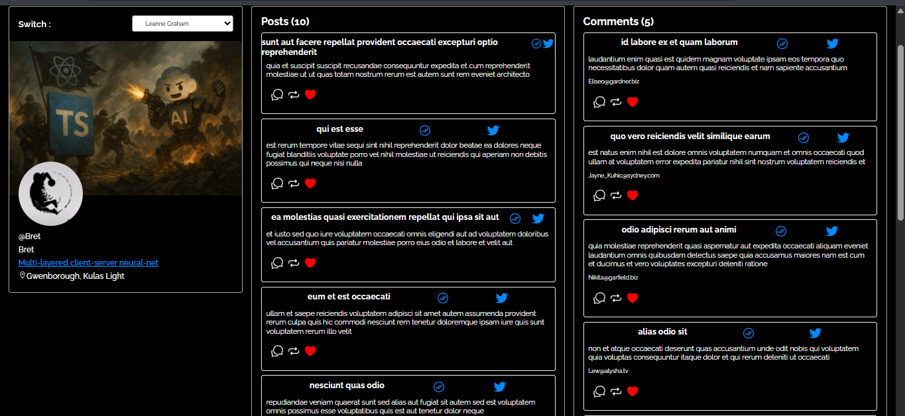
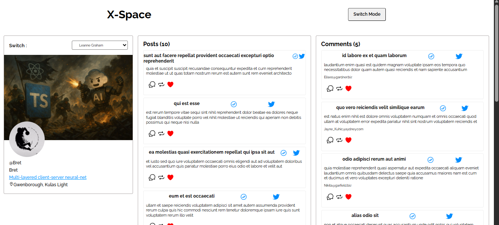
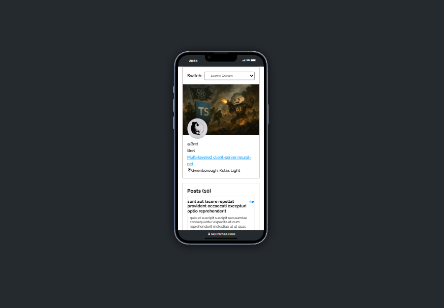

# X-Space Clone
# 🐦 Twitter Clone (Mini Social Feed)

A simple Twitter-like web application built using **TypeScript**, **HTML**, and **CSS** that allows users to:
- Select a user from a dropdown
- View that user's posts (tweets)
- Click a post to view comments
- Display user profile details like bio, location, and more

Data is fetched from the [JSONPlaceholder API](https://jsonplaceholder.typicode.com/), a free REST API for testing and prototyping.

---
## 📷 Screenshots

---

## 🚀 Features

- 🧑‍💼 User selection dropdown
- 📄 Dynamic posts dispalying
- 💬 Comment loading on post click
- 👤 User profile with bio and location
- ✅ Type-safe data handling with TypeScript
- 🔄 Responsive and interactive UI with Ionicons
- 🌓 Switching dark mode to light mode

---

## ⚒️ Tech Tack Used

- Typescript
- Html
- Css
- Vercel for Deployment

---

## Thank  You For Visiting